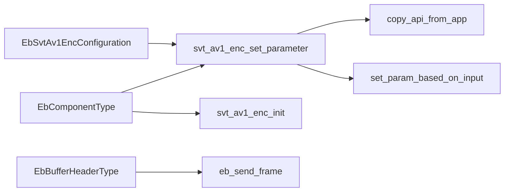
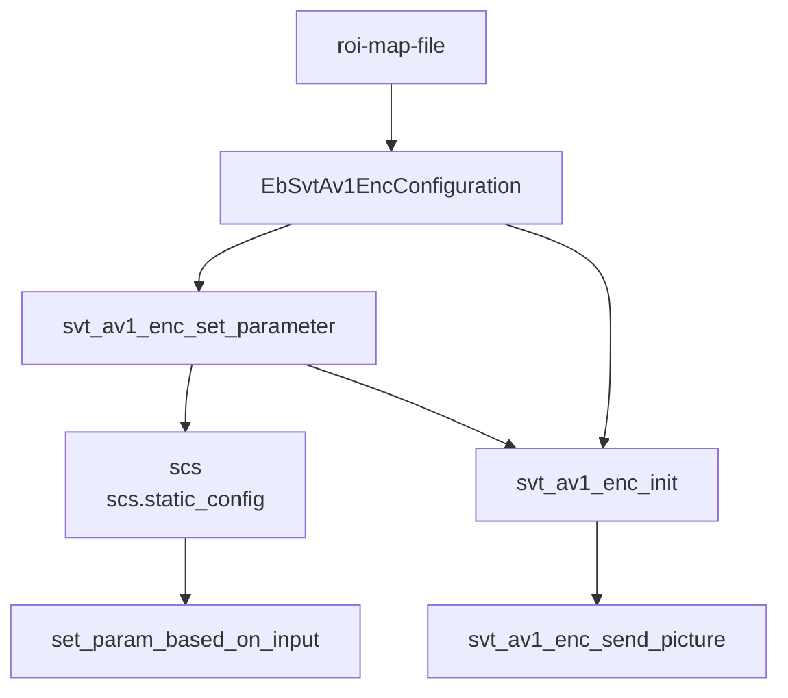
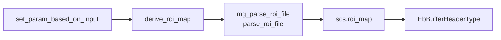

# svt-av1 基于segment的roi调整qindex原理

## 总述
基于Segment的QP调整有三个步骤
1. setup segment    设置segment
2. find block's segment_id  设置块的segment_id
3. adjust qp        调节qindex

### setup segment
mg_parse_roi_file/parse_roi_file
mg_segment_salicency_image
mg_roi_map_setup_segmentation/roi_map_setup_segmentation

### find block's segment_id
mg_roi_map_apply_segmentation_based_quantization/roi_map_apply_segmentation_based_quantization

### adjust qp
在量化/反量化阶段, 会传入base_qindex及segment_qindex, 量化时使用的qindex=base_qindex + segment_qindex(offset)

# 分析
目前使用svt-av1中原有的roi-map-file机制处理MG私有的roi文件

就目前对SVT-AV1代码的理解，此oir文件仅在Codec客户端通过命令行传入，暂未发现Encoder的Lib内处理参数的方式；可以参考qp等参数是如何从ffmpeg传入Encoder内的【经验证是通过其接口文件提供的结构体由ffmpeg配置传入，详细见下文】。

框架:ffmpeg解析	→	SvtContext	→	Codec-api	 →	 codec内部解析

Codec接口：

- svt_av1_enc_init_handle

- svt_av1_enc_set_parameter

- svt_av1_enc_init

- svt_av1_enc_stream_header

- svt_av1_enc_stream_header_release

其中，主要跟参数配置相关的接口如下

## svt_av1_enc_init_handle
创建Handle相关操作并以默认值初始化EbSvtAv1EncConfiguration结构体

## svt_av1_enc_set_parameter
解析接口头文件中EbSvtAv1EncConfiguration结构体的信息![1]
解析输入并推导相关参数![2]
帧结构计算  ?Process:Task![3]
打印库内实际参数![4]

[1] EbSvtAv1EncConfiguration  -> SCS        [copy_api_from_cpp]
[2] SCS(Input)  ->  SCS(Derived)            [set_param_based_on_input]
[3] [svt_aom_prediction_structure_group_ctor]
[4] [svt_av1_print_lib_params]


------------------------------------------------

从分析来看，SVT-AV1并未将其ROI-MAP-FILE机制写进Lib内；
表现在：
1. 接口关于配置的结构体EbSvtAv1EncConfiguration并无roi-map-file相关信息
2. SVT-AV1关于roi-map-file的读取解析等操作均在APP中的源文件中实现

此外，ffmpeg也尚未找到roi-map-file等参数的解析过程，甚至在libsvtav1.c的options也未找到解析svt-av1私有参数的位置。这意味着可能需要在ffmpeg中额外实现-svtav1-params的解析功能。【后续通过ffmpeg调用svt-av1，并配置ffmpeg命令行参数，看是否能正常解析-svt-av1参数以判断ffmpeg是否支持此功能】***下载到盗版ffmpeg(4.4)了,最新版ffmpeg7.1.1中是有-svt-av1参数解析的***需要更新libsvtav1.c到较新版本

Codec侧去SVT-AV1的Gitlab官网提Issue咨询是否如上述推测一样，SVT-AV1的ROI MAP机制未集成到其库内。【Gitlab中有相似Issue，基本确定是Encoder自身实现导致无法通过调用库的方式配置roi-map-file，需要自己实现相关代码】[ROI Issue](https://gitlab.com/AOMediaCodec/SVT-AV1/-/issues/2181)

# 解决方案

## ffmpeg的接口修改
原调用流程:
Init:
    svt_av1_enc_init_handle
    svt_av1_enc_set_parameter
    svt_av1_enc_init(EbComponentType)
    if
        svt_av1_enc_stream_header
        svt_av1_enc_stream_header_release
    endif
RecievePacket:
    svt_av1_enc_send_picture
    svt_av1_enc_get_packet
Close:
    svt_av1_enc_deinit
    svt_av1_enc_deinit_handle
## 修改svtav1的参数解析功能及接口
**目标：对roi_map_file的解析及处理函数放进segment.c及segment.h中**

tasks：

- ```FILE* roi_map_file ```放入接口结构体```EbSvtAv1EncConfiguration```

- parse_roi_map需要在Lib中实现， 否则无法规范地在Lib内解析处理roi_map_file
    在```set_param_based_on_input```中调用，将roi_map写入```(EbComponentType)enc_handle->scs_instance_array[0]->scs```中
    Lib对外提供EbComponentType的访问

- ```SvtAv1RoiMap *roi_map``` 需要从```parse_roi_map```传递到```app_cfg->input_buffer_pool```中
    retrieve_roi_map中mount, 此过程应置于接口函数中,svt_av1_enc_init?
    mount过程需要(EbComponentType)enc_handle[src], EbBufferHeaderType *header_ptr[dst]

- SvtAv1RoiMap *roi_map 需要从parse_roi_map传递到 app_cfg->input_buffer_pool中

- parse_roi_map可能需要在Lib中实现， 否则无法规范地在Lib内解析处理roi_map_file
retrieve_roi_map_event的功能即挂载roi_map_event也需在能获取scs的地方实现
在copy_api_from_app函数上的那个函数set_param_based_on_input中实现 
- 从FILE* 到 scs.roi_map的方法derive_roi_map? 可将原来app_context中解析roi_file相关的函数均在此函数中实现。
- roi_map_file 与 FILE*  。 接口结构体传入文件名，derive_roi_map（库内）读取并解析文件。
- open_file(&cfg->roi_map_file, token, value, "rb");

#### 数据流







----------------------------------------------
## 问题

1. svt的机制会将scs_pool中的多个scs指向相同的roi_map， 导致重复释放已释放的内存空间
    可能是roi_map被从scs_instance的scs浅拷贝至scs_pool的scs_arr[0]