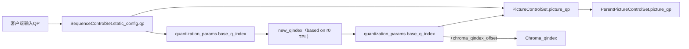

# High level Syntax

- Frame Header
    quantization_params() -> base_q_idx 帧级基础qindex

    segmentation_params() -> feature_value[][0] Segment级offset

    decode_block() -> mode_info -> intra/inter -> frame_mode_info() -> read_delta_qindex() -> sb_delta_q  SB级offset

# Code Level process

客户端输入qp -> SequenceControlSet.static_config.qp -> PictureControlSet.picture_qp -> 
                        |-> quantization_params.base_q_index  -> new_qindex（based on r0 TPL）-> quantization_params.base_q_index

svt_aom_apply_segmentation_based_quantization 中必须能获取当前块的segment_id, 从入参分析在PictureControlSet中传入比较合适
从SequenceControlSet中读取