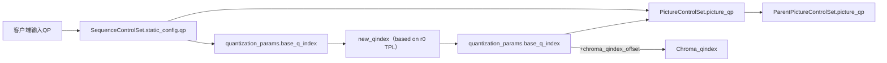

# High level Syntax

- Frame Header
    quantization_params() -> base_q_idx 帧级基础qindex

    segmentation_params() -> feature_value[][0] Segment级offset

    decode_block() -> mode_info -> intra/inter -> frame_mode_info() -> read_delta_qindex() -> sb_delta_q  SB级offset

    intra_frame_mode_info   ->  intra_segment_id    ->  read_segment_id ->  segment_id
# Code Level process

客户端输入qp -> SequenceControlSet.static_config.qp -> PictureControlSet.picture_qp -> 
                        |-> quantization_params.base_q_index  -> new_qindex（based on r0 TPL）-> quantization_params.base_q_index


svt_aom_apply_segmentation_based_quantization 中必须能获取当前块的segment_id

 -6.1432 - 2.754 * cos(0.898 * j) + 5.072 * sin(0.898 * j) - 2.166 * cos(2 * 0.898 * j) - 0.241 * sin(2 * 0.898 * j)−0.282 * cos(3 * 0.898 * j)−0.778sin(3 * 0.898 * j) +0.265cos(4 * 0.898⋅x) −0.441sin(4 * 0.898⋅x)

# ROI MAP


parse_rio_map_file: 读取roi_map_file并提取信息至app_cfg->roi_map
retrieve_roi_map_event: app_cfg->roi_map移交给app_cfg->input_buffer_pool, 以节点的形式留存
```cpp

//  数据结构

typedef struct SvtAv1RoiMapEvt {
    //  每个event对应一帧的roi信息
    uint64_t                start_picture_number;   //  当前图片序号
    uint8_t                *b64_seg_map;            //  每个b64对应的seg_id
    int16_t                 seg_qp[8]; // 8: MAX_SEGMENTS   降序排列的qp_offset
    int8_t                  max_seg_id;             //  当前帧最大seg-ID
    struct SvtAv1RoiMapEvt *next;
} SvtAv1RoiMapEvt;
typedef struct SvtAv1RoiMap {
    uint32_t         evt_num;
    SvtAv1RoiMapEvt *evt_list;
    SvtAv1RoiMapEvt *cur_evt;
    int16_t         *qp_map;                        //  b64的QPoffset
    char            *buf;                           //  字符串临时缓冲区
} SvtAv1RoiMap;

static EbErrorType parse_roi_map_file(EbConfig *app_cfg) {
    const int32_t MAX_SEGMENTS = 8;
    FILE         *file         = app_cfg->roi_map_file;
    if (file == NULL) {
        return EB_ErrorBadParameter;
    }

    // ROI map file format:
    // One ROI event per line. The event is in below format
    // <pic_num> <b64_qp_offset> <b64_qp_offset> ... <b64_qp_offset>\n
    // b64_qp_offset range -255 ~ 255
    EbErrorType      ret      = EB_ErrorNone;
    SvtAv1RoiMap    *roi_map  = calloc(1, sizeof(*app_cfg->roi_map));
    SvtAv1RoiMapEvt *last_evt = NULL;
    const size_t     b64_num = ((app_cfg->config.source_width + 63) / 64) * ((app_cfg->config.source_height + 63) / 64);
    // Multiplied by 5 because each qp_offset value requires at most 4 chars plus a space.
    // Multiplied by 2 to make some extra space.
    const size_t buf_size = b64_num * 5 * 2;
    char        *buf      = malloc(buf_size);
    int16_t     *qp_map   = malloc(sizeof(*qp_map) * b64_num);
    if (!roi_map || !buf || !qp_map) {
        ret = EB_ErrorInsufficientResources;
        goto fail;
    }
    roi_map->evt_num  = 0;
    roi_map->evt_list = NULL;
    roi_map->cur_evt  = NULL;
    roi_map->buf      = buf;
    roi_map->qp_map   = qp_map;
    app_cfg->roi_map  = roi_map;

    while (fgets(buf, (int)buf_size, file)) {
        if (strlen(buf) == buf_size - 1) {
            fprintf(stderr, "Warning - May exceed the line length limitation of ROI map file\n");
        }
        if (buf[0] != '\n') {
            char    *p              = buf;
            char    *end            = p;
            uint64_t picture_number = strtoull(p, &end, 10);
            if (end == p) {
                // no new value parsed
                break;
            }
            if (picture_number == ULLONG_MAX || end == NULL) {
                ret = EB_ErrorBadParameter;
                break;
            }

            // allocate a new ROI event
            SvtAv1RoiMapEvt *evt = calloc(1, sizeof(*evt));
            if (!evt) {
                ret = EB_ErrorInsufficientResources;
                goto fail;
            }
            evt->b64_seg_map = malloc(b64_num);
            if (!evt->b64_seg_map) {
                free(evt);
                ret = EB_ErrorInsufficientResources;
                goto fail;
            }
            if (roi_map->evt_list != NULL) {
                last_evt->next = evt;
            } else {
                roi_map->evt_list = evt;
            }
            last_evt = evt;

            evt->start_picture_number = picture_number;
            evt->max_seg_id           = -1;

            // 1. parsing qp offset
            // 2. decide qp offset of each segment from qp offset map
            // 3. translate qp offset map to a segment id map
            size_t i;
            //< 遍历当前帧全部blk64
            for (i = 0; i < b64_num; ++i) {
                p            = end;
                long int val = strtol(p, &end, 10);
                if (end == p) {
                    // no new value parsed
                    break;
                }
                if (val <= 255 && val >= -255) {
                    qp_map[i] = (int16_t)val;
                    // map qp offset to segment id
                    int8_t seg_id = 0;
                    for (; seg_id <= evt->max_seg_id; ++seg_id) {
                        if (qp_map[i] == evt->seg_qp[seg_id]) {
                            break;
                        }
                    }
                    if (seg_id > evt->max_seg_id && evt->max_seg_id < MAX_SEGMENTS) {
                        //  记录出现的前8个不同的qp_offset
                        evt->seg_qp[seg_id] = qp_map[i];
                        evt->max_seg_id     = seg_id;
                    } else if (seg_id > evt->max_seg_id && evt->max_seg_id >= MAX_SEGMENTS) {
                        ret = EB_ErrorBadParameter;
                        fprintf(stderr,
                                "Error: Invalid ROI map file - Maximum number of segment supported "
                                "by AV1 spec is eight\n");
                        break;
                    }
                } else {
                    ret = EB_ErrorBadParameter;
                    fprintf(stderr,
                            "Error: Invalid ROI map file - Invalid qp offset %ld. The expected "
                            "range is between -255 and 255\n",
                            val);
                    break;
                }
            }
            if (i < b64_num) {
                ret = EB_ErrorBadParameter;
                fprintf(stderr, "Error: Invalid ROI map file - not enough qp offset within a ROI event\n");
            }
            if (ret != EB_ErrorNone) {
                break;
            }

            // sort seg_qp array in descending order
            qsort(evt->seg_qp, evt->max_seg_id + 1, sizeof(evt->seg_qp[0]), compare_seg_qp);
            if (evt->seg_qp[0] < 0) {
                fprintf(stderr, "Warning: All qp offsets are negative may result in undecodable bitstream\n");
            }

            // translate the qp offset map provided in the ROI map file to a segment id map.
            for (i = 0; i < b64_num; ++i) {
                for (int seg_id = 0; seg_id <= evt->max_seg_id; ++seg_id) {
                    if (qp_map[i] == evt->seg_qp[seg_id]) {
                        evt->b64_seg_map[i] = seg_id;
                        break;
                    }
                }
            }

            ++roi_map->evt_num;
#if DEBUG_ROI
            fprintf(stdout,
                    "ROI map event %" PRIu32 ". start picture num %" PRIu64 "\n",
                    roi_map->evt_num,
                    evt->start_picture_number);
            fprintf(stdout, "qp_offset ");
            for (int i = 0; i <= evt->max_seg_id; ++i) { fprintf(stdout, "%d ", evt->seg_qp[i]); }
            fprintf(stdout, "\n");
            int column_b64 = (app_cfg->config.source_width + 63) / 64;
            int row_b64    = (app_cfg->config.source_height + 63) / 64;
            for (int i = 0; i < row_b64; ++i) {
                for (int j = 0; j < column_b64; ++j) { fprintf(stdout, "%d ", evt->b64_seg_map[i * column_b64 + j]); }
                fprintf(stdout, "\n");
            }
            fprintf(stdout, "\n");
#endif
        }
    }

    if (roi_map->evt_num == 0 && ret == EB_ErrorNone) {
        // empty roi map file
        ret = EB_ErrorBadParameter;
    }
    return ret;
fail:
    if (last_evt) {
        for (SvtAv1RoiMapEvt *evt = roi_map->evt_list; evt != last_evt;) {
            SvtAv1RoiMapEvt *next = evt->next;
            free(evt->b64_seg_map);
            free(evt);
            evt = next;
        }
    }
    free(qp_map);
    free(buf);
    free(roi_map);
    return ret;
}


static EbErrorType retrieve_roi_map_event(SvtAv1RoiMap *roi_map, uint64_t pic_num, EbBufferHeaderType *header_ptr) {
    if (roi_map == NULL || roi_map->evt_list == NULL) {
        return EB_ErrorNone;
    }
    SvtAv1RoiMapEvt *evt = roi_map->cur_evt != NULL ? roi_map->cur_evt->next : roi_map->evt_list;
    if (evt == NULL) {
        return EB_ErrorUndefined;
    }

    if (pic_num != evt->start_picture_number) {
        return EB_ErrorNone;
    } else {
        roi_map->cur_evt = evt;
    }

    EbPrivDataNode *new_node = (EbPrivDataNode *)malloc(sizeof(EbPrivDataNode));
    if (new_node == NULL) {
        return EB_ErrorInsufficientResources;
    }
    SvtAv1RoiMapEvt *data = evt; // shallow copy
    new_node->size        = sizeof(SvtAv1RoiMapEvt *);
    new_node->node_type   = ROI_MAP_EVENT;
    new_node->data        = data;
    new_node->next        = NULL;

    // append to tail
    if (header_ptr->p_app_private == NULL) {
        header_ptr->p_app_private = new_node;
    } else {
        EbPrivDataNode *last = header_ptr->p_app_private;
        while (last->next != NULL) { last = last->next; }
        last->next = new_node;
    }

    return EB_ErrorNone;
}
```