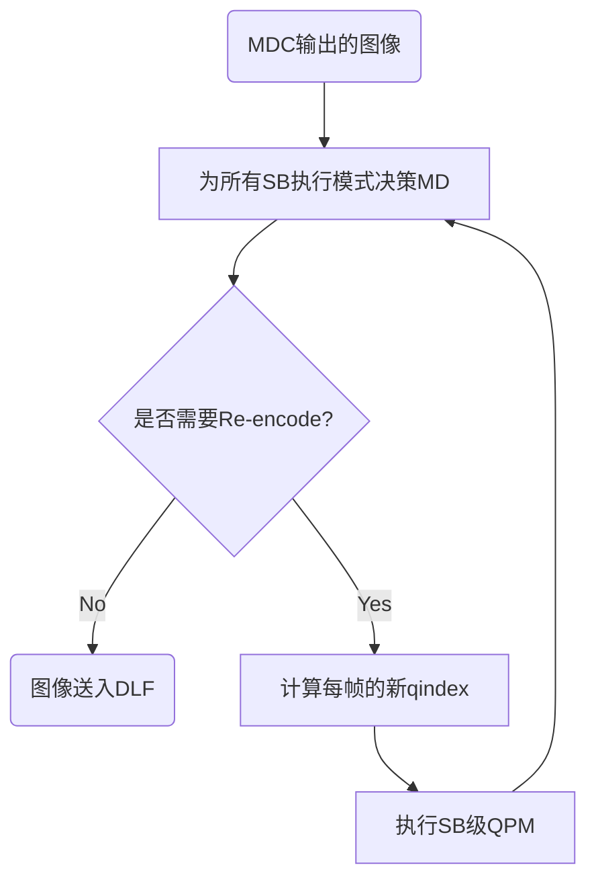

# High Level Idea

# 1 pass VBR + Look Ahead

此模式下的延迟有look ahead的滑动窗大小决定.在LAD的滑动窗中对帧进行运动估计, 得到的统计信息用于码率控制. 默认的LAD大小约为2个Mini-GOP, 最大可扩展为120帧.

# 2 pass VBR

2pass模式只能用于对延迟不敏感的场景下.此模式提供最佳的BD-rate以及最佳的码率匹配效果.在1st pass, 编码器以与2nd pass相同的预测结构(参考结构)运行,不过是以CRF模式运行.收集到的数据存储在内存或文件中并且用于下一pass的编码.使用相似的预测结构对于码率分配显著的提升.提前执行一次码率接近于target码率的pass,对于最终实现目标码率有很可观的作用.wnd pass使用之前pass的数据以实现最佳的性能.

## VBR 码控流程

### First-Pass: 基于pass2预测结构的CRF编码

可靠的码率控制一般需要准确的统计信息来合理分配码率预算并遵循应用程序施加的限制.即使一个IPP结构的pass能为下一pass提供有用的信息, 它产生的统计信息也不完全精确到能为下一pass体统完美的码率分配决策.而使用与pass2相同预测结构的CRF pass, 能提供足够精确的码率估计, 从而为pass2的码率控制决策提供更可靠的依据.Pass1是Pass2的快速版本, 具备Pass2相似的预测结构.

为了提升统计信息准确度, 使用输入尺寸,帧率和目标码率来估计First-Pass的输入QP从而逼近目标码率.这个步骤总体上能优化oass2码控时的码率逼近效果.First-Pass会存储每帧的如下信息:Picture Number,total number of bits, qindex for the frame, qindex for the sequence. 参见***StatStruct***结构体
```cpp
// svt-av1 v3.1.0
typedef struct StatStruct
{
    uint64_t   poc;
    uint64_t   total_num_bits;
    uint8_t    qindex;
    uint8_t    worst_qindex;
    uint8_t    temporal_layer_index;
} StatStruct;
```

为了降低First-Pass的速度开销, 在pass1使用了更快的preset. 举例来说吗如果pass 2使用preset5, 那么pass1使用preset11.为了使pass1更快, 附录B简要描述了一些额外的速度优化项.

### Second-Pass
pass 2的码率控制包含如下步骤:

1. 为每个GOP或KF_group分配目标比特数 [kf_group_rate_assingment()]
2. 为每个mini-GOP或GF_group的每帧分配目标比特数 [gf_group_rate_assingment()]
3. 基于反馈和内部buffer更新每帧的目标比特数[av1_set_target_rate()]
4. 基于tpl boost及目标比特数分配每帧的qindex[rc_pick_q_and_bounds()]
5. SB级QP调整以及基于TPL生成Block级lambda[sb_qp_derivation_tpl_la()]
6. 在Mode Decison工序结束时决策是否执行re-encode[recode_loop_decosion_maker()]
7. 接受反馈后更新post-encode VBR的数据[av1_rc_postencode_update()]

## 细节描述

### GOP级比特分配(get_kf_group_bits())
- 1pass VBR + LAD with Look Ahead Shorter than GOP Size

    此情形下, LAD不足以覆盖整个GOP, 因此使用统一的码率分配.```kf_group_bits = number of frames in GoP * avg_bits_per_frame```, 其中,avg_bits_per_frame表示每帧的平均比特数.

- 1pass VBR + LAD with Look Ahead Longer than size 

    若pass 1的统统数据可覆盖一整个GOP, 使用帧误差来为GOP分配比特```kf_group_bits = bits_left * (kf_group_err / modified_erro_left)```,其中,
    
    - bits_left 为该视频片段中剩余的比特预算
    - kf_group_err 是该 GOP（图像组）的计算误差，等于该 GOP 中所有帧误差之和
    - modified_erro_left 为视频片段中剩余帧的误差
    
    注意,这里的误差指得是每一帧的运动估计误差.

- 2Pass VBR:

    在此模式下, 误差被前一pass的实际比特数代替. ```kf_group_bits = bits_left * (kf_group_rate_in_ref / rate_in_ref_left)```, 其中, kf_group_rate_in_ref是前一CRF pass中该GOP的实际比特数之和, ```rate_in_ref_left```是剩余帧的实际比特数之和.

 ### mini-GOP级比特分配(calculate_total_GF_group_bits())

 Mini-GOP级的码率分配与GOP级相似.基于VBR模式, 有如下几种情景:

- 1pass VBR + LAD

    省略
- 2pass VBR

    此情形下, 误差备用前一pass的实际比特数代替.```GF_group_bits = kf_bits_left * (GF_group_rate_in_ref / rate_in_ref_kf_left)```, GF_group_bits是前一CRFpass对应gf_group或Mini-GOP中对应帧的实际比特数总和. rate_in_ref_kf_left是GOP中剩余Mini-GoP中的帧的的实际比特数之和.

### Frame级比特分配

计算完每个GOP和mini-GOP的码率后, 码控算法将计算每帧的基础码率. mini-GOP中所有帧的码率数据存储在GF_group->bit_allocation[]中, 之后会复制到PCS结构体中的base_frame_target中.

- 1pass VBR + LAD

    省略
- 2pass VBR
    此情形下,使用之前pass的实际码率数据来计算每帧的码率预算. ```bit_allocattion = GF_group_bits * total_num_bits / gf_stats.GF_group_rate```, total_num_bits(stat_struct.total_num_bits)是当前帧在之前pass中的实际比特数, GF_group_rate(gf_stats.GF_group_rate)是前一pass中分配当前帧所属mini-GOP或GF group的总比特数.

    在使用look ahead或之前pass的数据计算完每帧的基础目标比特数后(base_frame_target), 码控会基于从packetization受到的反馈来更新目标预算.```thist_frame_target = base_frame_target + (vbr_bits_off_target >= 0)?max_delta:-max_delta```, 其中this_frame_target 是更新后的目标比特数, vbr_bits_off_target计算如下:```vbr_bits_off_target += base_frame_target - actual_frame_size```, vbr_bits_off_target > 0意味着有额外的码率预算可用, vbr_bits_off_target < 0意味着使用的码率资源超标了.max_delta基于vbr_bits_off_target和剩余帧数量得来(例如max_delta = vbr_bits_off_target / number_of_remaining_frames).

### Frame级QP分配

之后, qindex一大多数QP值而言一般是qindex=4*QP, qindex代替QP成为编码器内部实际使用的量化参数. 当一帧给定目标比特分配后,当前的目标便是寻找一个qindex使得这一帧在编码后的大小尽可能接近其目标比特数.为实现这一目标，首先基于 TPL（Temporal dePendency modeL）数据、码率控制缓冲区状态以及第一遍编码的统计信息，确定一个候选 qindex（量化索引）取值范围。随后，利用预定义的查找表（该表建立了 qindex 与编码比特数之间的映射关系），从中选择能够产生最接近目标码率的 qindex，并将其用于当前帧的编码.

#### 确定qindex值的子集
qindex的取值范围为[active_best_quality, active_worst_quality], 计算方式如下

#####  active_worst_quality
active_worst_quality表示每个mini-GoP被分配的最大的qindex值, 通常被非参考帧使用. 会在每个mini-GOP中使用前一pass的数据计算得来, 之后基于内部码率控制缓冲区状态来更新.

首先,计算每个mini-GOP的总目标比特数,使用mini-GOP的帧数和每个图像中16x16块的个数,计算每个16x16块的**目标比特数**. 之后循环迭代qindex值并且使用qp->bits的LUT及correction factor估算每个16x16块的比特数,比特数最接近目标比特数的qindex被选为最终图像的qindex.(见av1_rc_regulate_q()及get_two_pass_worst_quality())

##### active_best_quality
active_best_quality的值表示在给定active_worst_quality后能被分配的最小qindex值. VBR模式的picture级qindex在*rc_pick_q_and_bounds()*函数中计算, 计算细节如下:

active_best_quality的计算取决于active_worst_quality和TPL中收集的数据. 与CRF相似, 使用常规基于TPL的QP缩放以提升分层预测结构的性能.通常低时域层图像使用小的量化参数, 因为低时域层图像一般用作更高时域层图像的参考图像. 在TPL算法中, 传播因子r0用于提升基础层图像的QP分配.主要思想r0越小图像越需要更多质量提升.下面介绍QPS调整的总体思想, TPL算法的细节参考TPL的技术文档.

- Intra:关键帧(IDR)和非关键帧(CRA)的active_best_quality使用相似的方法产生但有一些细微不同. r0值小的图像会被分配更低的active_best_quality. 这么调整的主要目的如下:

    - 基于图像的r0计算qsteo_ratio, qsteo_ratio与$\sqrt{r0}$成正比
    - 基于目标量化补偿active_worst_quality和qsteo_ratio计算目标量化步长
    - 最接近目标量化补偿的qindex作为图像的qindex

- Inter:
    - Base Layer: 与Intra的逻辑相同, 仅qsteo_ratio的权重不同
    - 非基础层: 不使用tpl的数据. active_best_quality = (前一层帧的active_best_quality + 1)与active_worst_quality的平均值.

#### 确定最佳qindex
当active_worst_quality和active_best_quality计算好后, 算法将从[active_best_quality, active_worst_quality]中选择使码率最接近目标码率(见av1_rc_regulate_q()). 首先, 计算每个16x16块的的目标码率, 然后遍历可用的qindex值,并使用预定义的LUT表和correction_factor预测每个16x16块的码率.LUT表建立qindex与码率之间的映射关系.使码率最接近目标码率的qindex被选为当前帧的最终qindex.

### SB级QP调整算法
SB级QP调整基于TPL, 与CRF模式的QP调整算法相同. 在TPL算法中, 参数$\beta$在SB级的作用与r0在图像级的作用相同. 因此, 对于给定的SB, 大的$\beta$表示SB需要更多质量提升. 对于每个SB, QP调节的主要思想为:新的QP使用对应的beta值计算:

$$QP' = \frac{QP}{f(beta)}, 
f()=
\begin{cases}
\sqrt{\dots}& , \beta <1 \\ 
\sqrt{\sqrt{\dots}}& ,  Otherwise
\end{cases}$$

在TPL QP调整之后的情形如下:

- 若 beta > 1 -> rk < r0 -> SB的质量未达到平均图像质量 -> 降低SB的QP. 如: $QP' = \frac{QP}{\sqrt{beta}}$ 或 $QP' = \frac{QP}{\sqrt{\sqrt{beta}}}$. 由于beta > 1, QP' < QP.

- 若 beta < 1 -> rk > r0 -> SB的质量超出平均图像质量 -> 提升SB的QP. 如: $QP' = \frac{QP}{beta}$ 或 $QP' = \frac{QP}{\sqrt{beta}}$ 或 $QP' = \frac{QP}{\sqrt{\sqrt{beta}}}$. 由于beta < 1, QP' > QP.

### 基于块的Lambda调整算法
块级lambda调节算法基于TPL, 与CRF模式相同.
- 对于给定SB,更新16x16块的tpl_rdmult_scaling_factors 

$$
tpl\_sb\_rdmult\_scaling\_factors = \frac{new\_rdmult}{orig\_rdmult}*\frac{tpl\_rdmult\_scaling\_factors}{geom\_mean\_tpl\_rdmult\_scaling\_factors}
$$

    其中,
    - seom_mean_tpl_rdmult_scaling_factor: SB中16x16块的tpl_rdmult_scaling_factors的几何平均值
    - orig_rdmult: 原始帧的qindex对应的lambda
    - new_rdmult: SB修改过后的qindex对应的lambda.上述缩放因子即为原始的 lambda 缩放因子 $\frac{new\_rdmult}{orig\_rdmult}$ 经过因子$frac{tpl\_rdmult\_scaling\_factors}{geom\_mean\_tpl\_rdmult\_scaling\_factors}$ 修正后的结果.

- 计算SB中给定block的rdmult
    - geom_mean_of_scale:
        - 16x16或更大块: 给定块(尺寸大于或等于16x16)内16x16块的tpl_sb_rdmult_scaling_factors的几何平均值
        - 小于16x16的块: 属于此块的16x16块的tpl_sb_rdmult_scaling_factors
    
    - new_full_lambda: $new\_full\_lambda = pic\_fulll\_lambda *  geom\_mean\_of\_scale +0.5$
        
        此处pic_full_lambda为原始帧的qindex对应的lambda

### Re-encoding

重编码机制用于达成理想的码率使其不至于过分地上溢或下溢. Re-encoding决策在模式决策结束时,且一整帧的常规编码结束之后进行. 由于Re-encoding的决策是发生在熵编码之前, 因此帧大小是在模式决策过程中的估计值而非打包阶段(Packetization)得到的实际帧大小. 比较预测码率与实际码率, 若不满足码率限制, 算法将会决定以新的qindex进行Re-encode. 一般来说,尽管SVT-AV1的设计非常灵活, 但Re-encoding仍将非常耗费资源,因此只有模式决策工序会再次执行, 其他的编码管线如运动估计, 熵编码或者环路滤波等没必要再执行一遍. Re-encode决策的机制如下表:


### Post Encode RC Update
在每帧都在Packetization工序中完全处理完后, 包含处理后帧大小的反馈信息送入码率控制算法中, 并且会更新内部的缓冲区以用于计算未来帧的qindex. 通过这样的机制, 算法将会持续跟踪编码帧目标比特数与实际比特数的的差异(vbr_bits_off_target).```vbr_bits_off_target += base_frame_target - projected_frame_size```, 这里的projected_frame_size即为实际码率. 基于vbr_bits_off_target的符号, 对于后续帧的目标码率将会进行一定幅度的调整以使vbr_bits_off_target维持在可接受的范围中. 所谓可接受的范围指的是以*undershoot_pct*和*overshoot_pct*控制的编码器输入.

*extend_minq* 和 *extend_maxq* 也是用于*active_worst_quality*和*active_worst_quality*修正的两个重要变量, 它的更新是通过比较*rate_error_estimate*, *undershoot_pct*和*overshoot_pct*来确定的:```rate_error_estimate = (vbr_bits_off_target * 100) / total_actual_bits```. 主要想法就是使用打包工序中的反馈薪资, 在best_quality和worst_quality之间更新qindex的范围. 当*rate_error_estimate* > *undershoot_pct* 时,编码器下溢 则active_worst_quality += 1, 否则active_worst_quality -= 1.