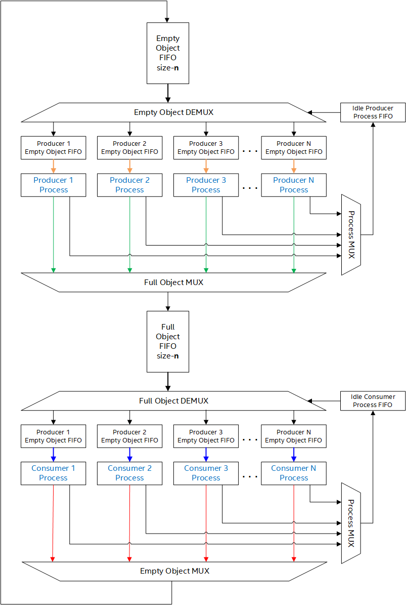

# Objects对象
Objects封装了工序间的数据及控制信息。这里的Object特指四种类型的数据和控制信息：序列控制集Sequence Control Sets, 图像控制集Picture Control Sets, 图像描述子Picture Descriptors 以及结果Result。

## SCS
序列控制集包含了系统资源（系统资源管理器，图像描述子池，api回调函数等）以及应用于多帧图像的编码配置参数（如GOP长度，预测结构，参参考图像数，运动估计搜索范围，目标码率等）

与序列控制集相关的数据结构在EbSequenceControlSet.h中定义

## PCS
图像控制集包含单帧图像的编码配置参数（如图像描述子，参考帧列表，SB运动及模式信息等）。由结果Object携带的信息生命周期最多为一个图像时间间隔。

与图像控制集相关的数据结构在EbPictureControlControlSet.h中定义

## Picture Descriptors
图像描述子包含了描述图像属性的数据及控制信息。输入、enhanced、运动补偿后的预测值、重建值、参考图像均包含相关的图像描述子。 此外在编码环路工序中产生的和熵编码工序中使用的变换系数也有相关的图像描述子。具体地，图像描述子可能包含：color space, bit depth, picture dimensions, 及指向图像数据的指针等。

与图像描述子相关的数据结构在EbPictureBufferDesc.h中定义

## Results
结果被用来传递两个工序之间的数据及信息。生产者工序填充结果而消费者工序使用其中的信息。消费者工序在开始执行前会等待前一个生产者工序的结果Object。结果object传递工序的状态是通过，直接传递编码器参数(bit depth, color space等)， 潜在地传递系统时机(比如何时开始执行)。

与结果对象相关的数据结构在xxResults.h中定义如EbRateControlResults.h

# 系统资源管理器 System Resource Manager

系统资源管理器通过控制objects的传递方式来管理对象并连接不同的工序。近乎所有的工序间通信都是通过SRm提供的工序间链接进行的。从编码器的框图可以看出只有SRM与结果对象有直接关联。但需要明确的是， 编码器框图并没有展示SRM与其他objects的关联。

## 资源管理组件 Resource manager compnents

### 空对象 FIFO Empty object FIFO 
空对象FIFO内包含尚未被分配给生产者工序的空对象。当一个object被释放时， 它将被插在FIFO的尾部。与所有对象一样， 空对象也没有被限制在单个资源管理器的上下文中使用。举个例子，SCS对象就贯穿整个编码管线。

### 生产者空对象 FIFO Producer Empty object FIFO
图中的Producer $i^{th}$ Empty Object FIFO包含了还没有被分配给Producer$i^{th}$生产工序的空对象。$i^{th}$生产者在执行前需要从$i^{th}$空对象FIFO中获取一个空的对象，$i^{th}$空对象FIFO被硬编码进$i^{th}$生产工序中。

### 生产者工序 Producer Process
生产者工序会将 生产者空对象FIFO 分配给他的空对象转变为满对象Full Object。生产者工序队列会最邻近地填充对象到满对象FIFO中。 值得注意的是， 在一个SRM中的生产者工序可能同时是另一个SRM中的消费者工序。当生产者工序完成其任务时，会将自己放进生产者工序FIFO。

### 生产者工序 FIFO Pruducer Process FIFO
生产者工序FIFO保存了等待被分配空对象以开始工作的生产者工序。若是没有生产者工序FIFO，生产者工序则必须轮询空对象FIFO，这会导致在空对象FIFO内无空对象时的低效运作。

### 满对象FIFO Full Objects FIFO
满对象FIFO保存了还没被分配给消费者工序的满对象。只有管理结果对象Result Objects的SRM有满对象FIFOs。

### 消费者满对象FIFO Consumer Full Object FIFO
图中的$j^{th}$消费者满对象FIFO包含了被分配到$j^{th}$消费者工序的满对象。**·$j^{th}$消费者工序在开始执行前须先从$j^{th}$消费者满对象FIFO中获取空对象。【图文描述不符】**，$j^{th}$消费者满对象FIFO与$j^{th}$也是硬连接的。

### 消费者工序
消费者工序使用其消费者满对象FIFO提供的满对象。消费者队列使用对象后会将其重新放回空对象FIFO。同生产者工序一样，一个SRM中的消费者工序同时也可以是另一个SRM中生产者工序。当消费者工序完成任务后，会被置于消费者工序FIFO。管理结果对象的SRM是唯一与消费者工序有关联的资源管理器。SCS、PCS图像描述子对象都没有消费者工序。

### 消费者工序FIFO
消费者工序FIFO包含等待被分配满对象的消费者工序。若没有消费者工序FIFO，在满对象FIFO中没有任何满对象时，消费者工序会低效地轮询满对象FIFO。

### 资源管理器执行流程快照
基于SRM框架图。
1. 生产者工序生产一个满对象（图中绿色箭头）
2. 满对象解复用器将对象推入 满对象FIFO
3. 满对象复用器检查消费者工序FIFO状态
    a. 消费者工序FIFO不为空
        分配满对象FIFO的首个对象给消费者工序FIFO的首个工序并唤醒此工序。
    b. 为空
        生产者工序从空对象FIFO请求一个空对象并继续步骤1
4. 步骤3a中被唤醒的工序开始工作冰消消耗掉满对象（蓝色箭头）
5. 消费者在其使用的满对象返回至空对象FIFO时便释放它

Tips：
- 步骤1、2由生产者工序实施。步骤3在 SRM的代码中实现， 步骤4、5由消费者工序执行
- 当$i{th}$生产者空对象FIFO为空时$i{th}$生产者工序不会激活
- 当$i{th}$消费者满对象FIFO为空时$i{th}$消费者工序不会激活
- 橙色箭头表示生产者进程获取空对象的过程，但该过程并未在上方的执行流程快照中描述

## 描述

st_av1_enc_init
    svt_aom_setup_common_rtcd_internal          (Run time cpu detection)
    svt_aom_setup_rtcd_internal
    
    svt_aom_asm_set_convolve_asm_table          (设置卷积asm函数指针表)
    svt_aom_init_intra_dc_predictors_c_internal (设置dc预测函数)
    svt_aom_asm_set_convolve_asm_table          (设置高比特卷积asm函数指针表)
    svt_aom_init_intra_predictors_internal      (设置帧内预测函数指针表)

    svt_aom_build_blk_geom                      (设置blk geometry)  
