<!-- @import "[TOC]" {cmd="toc" depthFrom=1 depthTo=6 orderedList=false} -->

<!-- code_chunk_output -->

- [资源管理](#资源管理)
  - [概述](#概述)
  - [存储结构Memory Structure](#存储结构memory-structure)
  - [资源视图](#资源视图)
  - [资源类型与管线绑定(Resource Type & Pipeline Bindings)](#资源类型与管线绑定resource-type--pipeline-bindings)
    - [高性能回读Performant Readback](#高性能回读performant-readback)
    - [Buffer](#buffer)
      - [顶点缓冲区Vertex Buffer](#顶点缓冲区vertex-buffer)
      - [索引缓冲区Index Buffer](#索引缓冲区index-buffer)
      - [常量缓冲区Constant Buffer](#常量缓冲区constant-buffer)
    - [纹理](#纹理)
      - [Texture1D](#texture1d)
      - [Texture1D Array](#texture1d-array)
    - [Texture2D & Texture2D Array](#texture2d--texture2d-array)
    - [TextureCube](#texturecube)
    - [Texture3D](#texture3d)
  - [子资源Subresource](#子资源subresource)
      - [访问子资源](#访问子资源)
        - [数组切片](#数组切片)
        - [Mip 切片](#mip-切片)
        - [选择单个子资源](#选择单个子资源)
        - [选择多个子资源](#选择多个子资源)
        - [平面切片Plane Slice](#平面切片plane-slice)
  - [资源操作](#资源操作)
    - [资源创建 #TODO(TO BE CONTINUED)](#资源创建-todoto-be-continued)
- [一些辅助理解的概念](#一些辅助理解的概念)

<!-- /code_chunk_output -->


# 资源管理
[资源 - Win32 apps | Microsoft Learn【推荐新手阅读】](https://learn.microsoft.com/zh-cn/windows/win32/direct3d11/overviews-direct3d-11-resources-buffers)
[Direct3D 11.3 Functional Specification](https://microsoft.github.io/DirectX-Specs/d3d/archive/D3D11_3_FunctionalSpec.htm#Unstructured)

## 概述
资源是场景的构建基块，包含Direct3D用于解释和呈现场景的大多数数据。资源向管道提供数据，并定义在场景中呈现的内容。资源是内存中可由Direct3D Pipeline访问的区域。包含以下类型的数据：几何图形数据、纹理数据、着色器数据。
    - 可创建强类型或无类型资源
    - 可控制资源是否同时具备读取和写入访问权限
    - 可让资源仅可供CPU/GPU访问
    - 每个管线阶段最多可有128个活动资源

Direct3D 资源的生命周期为：

    - 使用 ID3D11Device 接口的 create 方法之一创建资源。【创建】
    - 使用上下文和 ID3D11DeviceContext 接口的集方法之一将资源绑定到管道。【使用】
    - 通过调用资源接口的 Release 方法解除分配资源。【释放】


## 存储结构Memory Structure
代码定义见dxgiformat.h的enum DXGI_FORMAT，资源呗分配后通常有三种结构：Unstructured, Prestructured + Typeless, Prestructureed + Typed,Type基于数据类型，Typeless只指定位宽不指定数据类型，Typed直接指定数据类型。

可通过两种方式指定资源的布局或内存占用量
    - 完全类型化：创建资源是完全指定资源
    - 无类型（弱类型化）：在资源绑定到Pipeline时完全指定类型
• 完全类型化
创建时会将资源限制为创建时的格式。运行时可优化访问。
• 弱类型化
资源首次被创建时类型未知，Application必须从可用类型中选择，指定分配的内存大小及运行时是否要在mipmap中生成子纹理。数据格式直到资源绑定之具有资源视图的管线才被定义。可重复使用或解释。


单个资源可绑定到多个管线阶段，前提是每个资源具有唯一视图，如此可完全限定每个位置的格式。
    - Unstructured Memory
    - Structured Buffers
    - Raw Buffers（原始数据缓冲区/字节地址缓冲区）
    - Prestructured+Typeless Memory
    - Prestructured+Typed Memory

只有Buffer资源类型才有"Unstructured""Structured"一说，其中，Unstructured表示将资源识别为一个连续的内存块，没有 mipmap，也没有数组切片；Structureed标识资源为一个连续的内存块，没有mipmap或数组切片，但它确实具有结构大小（跨距stride），因此它表示一个**结构体数组**。Typeless通常限制位宽但不限制数据类型(如UINT64与FLOAT)，Tpyed则严格限制数据类型。
    
## 资源视图
Pipeline stage使用Resource View解释资源数据，Resource View在概念上类似于强制转换资源数据，Resource通过Resource View间接绑定Pipeline Stage，而Resource View则直接与pipeline绑定。

通过资源视图可以将资源分解为Mip Slices、Array Slies和Subresources，视图的有效尺寸和数组大小将小于等于原始资源。

每个pipeline stage都需要一个特定的视图类型，且每种视图类型都可能有自定义的状态参数集以完成将特定资源绑定到graphic pipeline stage的过程。

每种特定的试图类型都有某些与graphic pipeline stage的绑定位置相关的限制，比如 Buffer的Render Target View的最大宽度是16384，二这个最大值小于Buffer的最大尺寸的一半，所以一次只能将大Buffer的一部分绑定为渲染目标。

```cpp
//gc_umd_descriptor.h
enum Gc_DescriptorType	
{
    GC_RTV     = 1, //Render Target View
    GC_DSV     = 2, //Depth Stencil View
    GC_CBV     = 3, //
    GC_SRV     = 4, //Shader Resource View
    GC_UAV     = 5, //Unordered Access View
    GC_SAMPLER = 6
}
```

下面以Shader Resource View为例，阐释其创建方式，允许在任意着色器阶段对Raw and Structured Buffer进行只读访问。
- 创建
    - 创建Raw缓冲区的SRV：通过ld_raw指令声明，使其在任何着色器阶段可读。实现方法是在创建请求访问Raw缓冲区的缓冲区视图时指定一个标志。D3D11_DDI_BUFFERREX_SRC_FLAG_RAW
    - 创建结构化缓冲区的SRV：任何缓冲区的SRV都将继承结构化语义，并且不需要特别标明它是结构化的，因为在创建资源时缓冲区上的所有视图都会自动结构化（结构体stride）
- 清除
清除时一种优化操作，允许使用某些清除值填充Render Target、深度模板(Depth Stenci)和无序访问视图(Unordered Access View)

## 资源类型与管线绑定(Resource Type & Pipeline Bindings)

资源类型如下：
    - Buffer
    - Texture1D
    - Texture2D
    - Texture3D
    - Texture Cube
    - Unordered Access Views
    - Unordered Count & Append Buffers
    - Video Views
资源在创建时必须使用一组pipeline绑定标志进行限定，以指示其在图形管线中的绑定位置。资源可在管线中的多个位置绑定(甚至在某些限制下同时绑定)，而有时管线绑定标志又是互斥的。

### 高性能回读Performant Readback

任何用作图形管线输出的资源都无法映射/锁定，但可通过高性能回读的方式读取此类资源的内容，方式为  将内容复制到能够映射/锁定的资源中以进行CPU读取访问。

### Buffer

Buffer是一系列完全类型化的数据，可用来存储各类数据，包括位置矢量、法向矢量、顶点缓冲区中的纹理坐标、索引缓冲区中的索引和设备状态。

缓冲区包含用于描述几何图形、为几何图形信息和着色器常量编制索引的数据。

Direct3D 11 支持以下缓冲区资源类型。 所有缓冲区类型都由 ID3D11Buffer 接口封装。

- 顶点缓冲区
- 索引缓冲区
- 常量缓冲区

缓冲区是唯一可以创建的非结构化资源。当缓冲区绑定到图形管道时，其内存解释通常也必须与图形管道一起绑定（提供资源中元素的类型和偏移量，以及整体stride）。有时这些信息会单独绑定或描述。

缓冲区既没有多个mip level也没有multiple array slices，因此缓冲区仅由单个子资源组成。若缓冲区在每个位置只被Read，则在绘制调用期间可以在管道的多个位置同时绑定缓冲区。如果缓冲区正在被写入，则在绘制调用期间缓冲区只能绑定到管道的一个位置。

Buffer的生命周期
- 创建：ID3D11Device:CreateBuffer()
- 绑定（必须将Buffer绑定至Pipeline才能再访问它）
    - ID3D11DeviceContext::IASetVertexBuffers和ID3D11DeviceContext::IASetIndexBuffers将其绑定止IA阶段(Input Assembler)
    - ID3D11DeviceContext::SOSetTargets绑定止SO阶段(Stream Outputs)
    - 调用着色器方法(如ID3D11DeviceContext::VSSetConstantBuffer)绑定至着色器阶段(VS/HS/TS/DS/GS/PS/CS)

但需注意,Buffer可以绑定至多个Pipeline Stage进行读访问，也可绑定至单个Pipeline Stage进行写访问，但**不可同时绑定至多个Pipeline Stage进行写访问**。

#### 顶点缓冲区Vertex Buffer
顶点缓冲区包含用于定义几何图形的顶点数据。 顶点数据包括位置坐标、颜色数据、纹理坐标数据、法线数据等。

最简单的顶点缓冲区只包含位置数据。 它可进行可视化，如下图所示:
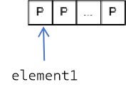

更常见的情况是，顶点缓冲区包含完全指定 3D 顶点所需的所有数据。 例如，一个顶点缓冲区可能包含位置、法线、纹理坐标和颜色数据。 这些数据可用于绘制复杂的 3D 几何图形，如下图所示:
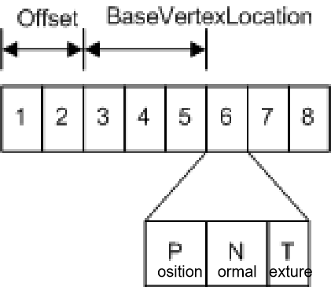

该顶点缓冲区包含每个顶点的数据；每个顶点存储三个元素（位置、法线和纹理坐标）。 位置和法线通常使用三个 32 位浮点 (DXGI_FORMAT_R32G32B32_FLOAT) 指定，纹理坐标使用两个 32 位浮点数 (DXGI_FORMAT_R32G32_FLOAT) 指定.

要从顶点缓冲区访问数据，需要知道访问的顶点，Offset(缓冲区起点到第一个顶点数据之间的字节数量)，BaseVertexLocation(从顶点缓冲区读取顶点之前添加到每个索引的值)

#### 索引缓冲区Index Buffer
索引缓冲区包含到顶点缓冲区的整数偏移量，用于更高效地渲染基元(几何形状的基本单元如点、线、三角形等)。索引缓冲区包含**一组连续的 16 位或 32 位索引**；每个索引用于标识顶点缓冲区中的一个顶点。
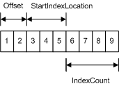

索引缓冲区开始位置 = 索引缓冲区基址 + 偏移量（字节）+ StartIndexLocation * ElementSize（字节）

其中，ElementSize是每个索引缓冲区元素的大小（两个或四个字节）

使用索引缓冲区，可以避免重复存储相同的顶点信息，从而提高渲染效率和性能。简单来说，就是用数字编号来指代顶点的位置，这样在绘制复杂图形时可以更加高效地利用资源。

#### 常量缓冲区Constant Buffer
常量缓冲区让你能够高效地向管道提供着色器**常量数据**。你可以使用常量缓冲区存储流输出阶段的结果。从概念上讲，常量缓冲区看起来就像**单元素**顶点缓冲区。
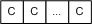

每个元素存储 1 到 4 个组件常量（由所存储数据的格式决定），若要从着色器读取着色器常量缓冲区，请使用HLSL加载函数 (例如Load)。每个着色器阶段允许最多15个着色器-常量缓冲区；每个缓冲区可包含最多4096个常量

### 纹理

纹理资源是用于存储纹素的数据的结构化集合。纹素表示可由管道读取的或可写入管道的纹理的最小单位。与缓冲区不同，在着色器单元读取纹理时，纹理采样器可筛选纹理。 纹理的类型将影响筛选纹理的方式。 每个纹素包含 1 到 4 个部分，它们按 DXGI_FORMAT 枚举定义的 DXGI 格式之一排列。

纹理被创建成具有**已知大小的结构化资源**。但是，只要在将纹理绑定到管道时使用视图完全指定类型，每个纹理资源在创建时有无类型均可。

有几种类型的纹理：1D、2D、3D，其中每种类型均可在有或没有 *mipmap* 的情况下创建。 Direct3D 11 还支持纹理数组和多重采样纹理。

- 1D 纹理
- 1D 纹理数组
- 2D 纹理和 2D 纹理数组
- 3D 纹理

#### Texture1D
最简单形式的 1D 纹理包含可使用**单个纹理坐标**寻址的纹理数据；它可以可视化为**纹素(*Texel*)数组**，如下图所示。
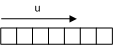

每个纹素均包含大量颜色分量，具体取决于已存储数据的格式。 再复杂一些的话，你可以创建具有 mipmap 级别的 1D 纹理，如下图所示:
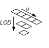

>   mipmap 级别是一个比它上面的级别小二次幂的纹理。 最上面的级别包含的细节最多，下面的每个级别逐渐减少。 对于 1D mipmap，最小的级别包含一个纹素。 此外，MIP 级别总是减小到 1:1。 在为奇数大小的纹理生成 mipmap 时，下一个较低级别始终为偶数大小（最低级别达到 1 时除外）。 例如，该图显示了一个 5x1 的纹理，其下一个较低级别为 2x1 纹理，再下一个（也就是最后一个）mip 级别为 1x1 大小的纹理。 这些级别通过称作 LOD（细节级别）的索引进行标识，用于在渲染离摄像机较远的几何图形时访问较小的纹理。

#### Texture1D Array
Direct3D 11 还支持纹理数组。 1D 纹理数组也由 ID3D11Texture1D 接口表示。 从概念上说，1D 纹理数组与下图类似:
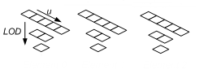
此纹理数组包含三个纹理。 三个纹理都是宽度为 5（即第一层中的元素数）的纹理。 每个纹理还包含一个 3 层 mipmap。

Direct3D 中的所有纹理数组都是<u>同类纹理数组</u>；这意味着，纹理数组中的每个纹理必须**具有相同的数据格式和大小**（包括纹理宽度和 mipmap 级别数）。 你可以创建具有不同大小的纹理数组，前提是每个数组中的所有纹理大小相同。

### Texture2D & Texture2D Array
Texture2D 资源包含 2D 纹素网格。 每个纹素均可通过 u, v 矢量进行寻址。 由于是纹理资源，它可能包含 mipmap 级别和子资源。
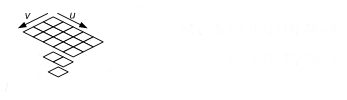
此纹理资源包含一个具有 3 个 mipmap 级别的 3x5 纹理

2D 纹理数组资源是一个同类 2D 纹理数组；也就是说，每个纹理具有相同的数据格式和维度（包括 mipmap 级别）。 它具有与 1D 纹理数组相似的布局，只不过纹理现在包含的是 2D 数据。
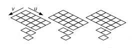

此纹理数组包含三个纹理；每个纹理均为具有两个 mipmap 级别的 3x5 纹理。

### TextureCube 

纹理立方体是一个包含 6 个纹理的 2D 纹理数组，其中每个纹理均表示立方体的一个面。 完全填充的纹理立方体如下图所示：
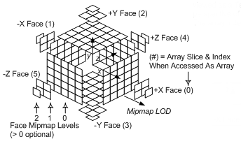

使用立方体纹理视图将包含 6 个纹理的 2D 纹理数组绑定到管道后，可以使用立方体贴图内部函数在着色器中读取该数组。 使用从纹理立方体的中心指向外的 3D 矢量从着色器对纹理立方体进行寻址。

### Texture3D
3D 纹理资源（也称作体积纹理）包含纹素的 3D 体积。 由于是纹理资源，它可能包含 mipmap 级别。 3D 纹理由 ID3D11Texture3D 接口表示。 <u>完全填充</u>的 3D 纹理如下图所示:
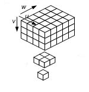

当 3D 纹理 mipmap 切片作为呈现目标输出绑定时（具有呈现-目标视图），3D 纹理的行为与具有 n 个切片的 2D 纹理数组的相同。 通过将输出数据的标量组件声明为SV_RenderTargetArrayIndex系统值，从几何着色器阶段选择特定呈现切片。

不存在 3D 纹理数组的概念；因此，3D 纹理子资源是单个 mipmap 级别。

## 子资源Subresource
子资源指资源的子集, 缓冲区被定义为一个子资源。纹理稍微复杂一些，因为有几种不同的纹理类型 (1D、2D 等) 其中一些类型支持 mipmap 级别和/或纹理数组。

从最简单的示例开始，1D 纹理被定义为单个子资源，如下图所示。


这意味着，构成 1D 纹理的纹素数组包含在单个子资源中。

如果扩展具有三个 mipmap 级别的 1D 纹理，则可以将其可视化，如下图所示:


将此视为由三个子资源组成的单个纹理。 可以使用单个纹理的详细级别 (LOD) 为子资源编制索引。 使用纹理数组时，访问特定子资源需要 LOD 和特定纹理。 或者，API 将这两条信息合并为一个从零开始的子资源索引，如下图所示：
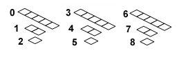

#### 访问子资源
某些 API 访问整个资源 (例如 ID3D11DeviceContext::CopyResource 方法) ，而其他 API 访问资源的一部分 (例如 ID3D11DeviceContext::UpdateSubresource 方法或ID3D11DeviceContext::CopySubresourceRegion 方法) 。访问资源部分的方法通常使用视图说明 (如 D3D11_TEX2D_ARRAY_DSV 结构) 来指定要访问的子资源。

##### 数组切片

给定纹理数组，每个具有 mipmap 的纹理，由白色矩形表示的 数组切片 () 包含**一个纹理及其所有子资源**，
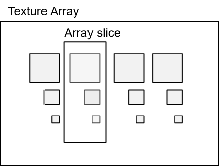

##### Mip 切片
由白色矩形表示的 mip 切片 () 数组中的**每个纹理包含一个 mipmap 级别**，如下图所示。
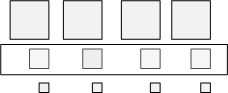


##### 选择单个子资源
你可使用这两种切片选择单个子资源，如下图所示。
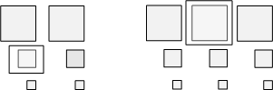


##### 选择多个子资源
或者，可以将这两种类型的切片与 mipmap 级别数和/或纹理数一起使用，以选择多个子资源，如下图所示。
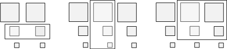

> 以下为 DX12 的子资源类型
##### 平面切片Plane Slice
通常，平面格式不用于存储 RGBA 数据，但在（可能是 24 bpp RGB 数据）的情况下，一个平面可以表示红色图像，一个平面可以表示绿色图像，一个平面可以表示蓝色图像。 虽然一个平面不一定是一种颜色，但两种或更多颜色可以组合到一个平面中。 更为典型的是，平面数据用于子采样的 YCbCr 和深度模具(Depth Stecil)数据。 深度模具是完全支持 mipmap、数组和多个平面的唯一格式（<u>通常，平面 0 用于深度，而平面 1 用于模具</u>）。

下面显示了包含两个深度模具图像的数组的子资源索引，每个都有三个 mip 级别。
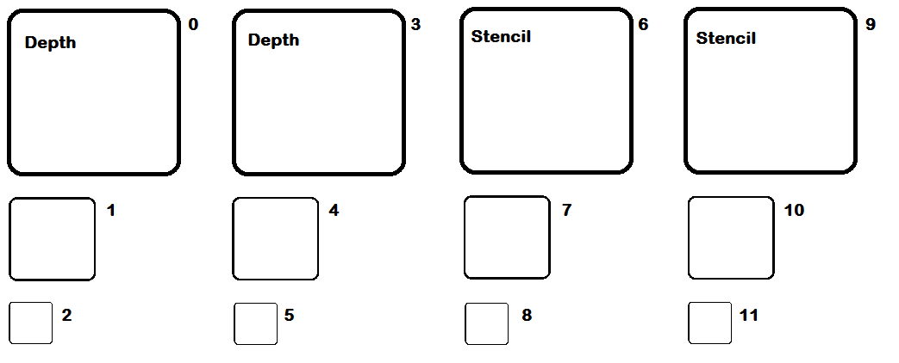

子采样的 YCbCr 支持数组且具有平面，但不支持 mipmap。 YCbCr 图像具有两个平面，一个平面用于人眼最敏感的亮度 (Y)，一个平面用于人眼不太敏感的色度（Cb 和 Cr，交错）。 此格式支持压缩色度值，以便在不影响亮度的情况下压缩图像，并且是出于此原因的常见视频压缩格式（尽管它用于压缩静态映像）。 下图显示了 NV12 格式，注意色度已压缩为亮度分辨率的四分之一，这意味着每个平面的宽度是相同的，并且色度平面是亮度平面高度的一半。 平面将作为子资源按照相同的方式编入索引到上述深度模具示例中。
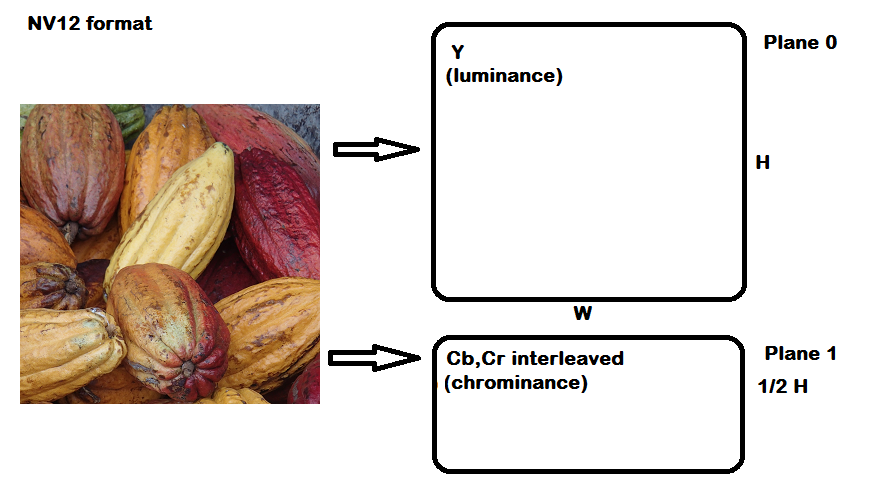

平面格式存在于 Direct3D 11 中，但无法单独处理各个平面，例如复制或映射操作。 已在 Direct3D 12 中对此进行更改，以便每个平面收到自己的子资源 ID。 比较以下两种方法来计算子资源 ID。

```cpp
inline UINT D3D11CalcSubresource( UINT MipSlice, UINT ArraySlice, UINT MipLevels )
{
    return MipSlice + (ArraySlice * MipLevels); 
}

inline UINT D3D12CalcSubresource( UINT MipSlice, UINT ArraySlice, UINT PlaneSlice, UINT MipLevels, UINT ArraySize )
{ 
    return MipSlice + (ArraySlice * MipLevels) + (PlaneSlice * MipLevels * ArraySize); 
}
```
## 资源操作 
### 资源创建 #TODO(TO BE CONTINUED)
资源具有一下共同熟悉，在资源创建时指定：
    - Type: Buffer, Texture1D, Texture2D, Texture3D, TextureCube
    - Format: 数据的格式如 DXGI_FORMAT
    - BindFlags: 指定资源如何绑定到管道,应用程序在创建时提供这些标志的组合以便对资源进行优化。如 D3D11_BIND_VERTEX_BUFFER, D3D11_BIND_CONSTANT_BUFFER, D3D11_BIND_DEPTH_STENCIL
    - 采样描述符：指定资源如何被采样，对于Buffer,Texture1D,Texture1D Array,Texture3D，采样数只能为1，质量级别只能为0。


# 一些辅助理解的概念
槽是 GPU 可以访问的一组预定义位置，用于存储各种资源。每个槽都有一个唯一的索引，资源可以通过这个索引进行绑定和访问。

常量缓冲区
1. **高效提供着色器常量数据**：首先，它提到常量缓冲区允许开发者高效地将一些不经常改变的数据（如光照参数、时间等）传递给着色器程序。这些数据被称为“常量”，因为它们在整个渲染过程中或至少在一个绘制调用期间保持不变。通过这种方式，可以减少每次绘制调用时重复设置相同数据的开销，提高性能。

2. **存储流输出阶段的结果**：其次，文中指出还可以利用常量缓冲区来保存流输出（Stream Output）阶段产生的结果。流输出是Direct3D等图形API中的一个功能，它允许将着色器处理后的几何数据直接输出到内存中，而不是立即绘制到屏幕上。这在诸如粒子系统、延迟渲染等高级技术中非常有用。将这些输出数据存入常量缓冲区，可以方便后续着色器阶段或其他部分代码访问和使用这些数据。

3. **单元素顶点缓冲区的概念**：最后，这句话从概念层面将常量缓冲区比作“单元素顶点缓冲区”。顶点缓冲区通常用于存储模型的顶点信息（如位置、颜色、纹理坐标等），而这里所说的“单元素”意味着常量缓冲区只包含一组固定的值，而不是多个顶点的信息。这种比喻有助于理解常量缓冲区的基本结构和使用方式，即它是一个小型的、专门用于存储少量固定数据的缓冲区，可以被快速访问和更新。

总之，常量缓冲区是图形编程中优化数据传输和提高渲染效率的重要工具之一。

在计算机图形学中，“纹素”（Texel）是指纹理图像中的最小单位，类似于像素（Pixel）是屏幕图像中的最小单位。每个纹素包含颜色和其他属性（如透明度、法线等），用于在三维模型表面生成详细的视觉效果。
特点：
- 位置：纹素在纹理图像中具有特定的位置坐标。[1]
- 属性：纹素可以包含多种属性，如颜色值、透明度、法线向量等。
- 映射：纹素通过纹理映射技术被映射到三维模型的表面上，从而增加模型的细节和真实感。


Sabrina Carpenter
*[LOD]: Level of Detail
*[HLSL]: High-Level Shader Language
*[bpp]: bits per pixel