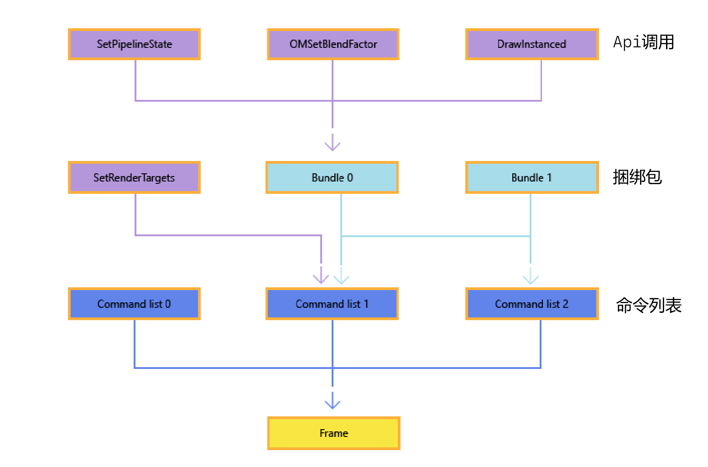

<!-- @import "[TOC]" {cmd="toc" depthFrom=1 depthTo=6 orderedList=false} -->

<!-- code_chunk_output -->

- [工作提交(Work Submission)](#工作提交work-submission)
  - [设计理念](#设计理念)
    - [删除即时上下文](#删除即时上下文)
    - [GPU工作项分组](#gpu工作项分组)
    - [GPU工作提交](#gpu工作提交)
  - [创建和记录命令列表与捆绑包](#创建和记录命令列表与捆绑包)

<!-- /code_chunk_output -->

# 工作提交(Work Submission)

参考资料
[Direct3D 12 中的工作提交](https://learn.microsoft.com/zh-cn/windows/win32/direct3d12/command-queues-and-command-lists)
[D3D12 Work Graphs](https://microsoft.github.io/DirectX-Specs/d3d/WorkGraphs.html#initiating-work-from-a-command-list)

为了提高 Direct3D 应用的 CPU 效率，从版本 12 开始，Direct3D 不再支持与设备关联的即时上下文。 相反，应用程序会记录并提交“**命令列表(Command List)**，其中包含<u>绘图</u>和<u>资源管理调用</u>。可以将这些命令列表从多个线程提交到一个或多个命令队列，命令队列用于管理命令的执行。这种根本性的改变通过允许应用程序**预先计算工作以供以后重用**，从而提高了单线程的效率，并且它通过将渲染工作分散到多个线程来利用; 

## 设计理念

- 删除即时上下文
- GPU工作项分组
- GPU工作提交

### 删除即时上下文
从 Microsoft Direct3D 11 到 Microsoft Direct3D 12 的最大变化是，不再存在与设备关联的单个即时上下文。 相反，为了渲染，应用创建命令列表，在其中可以调用传统的渲染 API。命令列表看起来类似于使用即时上下文的 Direct3D 11 应用的渲染方法，因为它**包含绘制基元或更改渲染状态的调用**。 像即时上下文一样，每个命令列表都不是自由线程；但是，可以同时记录多个命令列表，这利用了现代的多核处理器。命令列表通常执行一次。 但是，如果应用程序在提交新执行之前确保先前的执行完成，则可以多次执行命令列表。 有关命令列表同步的更多信息，请参阅- [执行和同步命令列表](#执行和同步命令列表)。

### GPU工作项分组
除命令列表之外，Direct3D 12 还通过添加 <u>第二级命令列表（称为“捆绑包Bundle”）</u> 来利用当前所有硬件中的功能。为了帮助区分这两种类型，可以将第一级命令列表称为“直接命令列表”。 捆绑包的目的是允许应用将少量 API 命令组合在一起，以便以后从直接命令列表中重复执行。在创建捆绑包时，驱动程序将执行尽可能多的预处理，以使以后的执行更高效。 然后可以在多个命令列表中执行捆绑包，并在同一命令列表中多次执行捆绑包。捆绑包的重用是单 CPU 线程提高效率的重要驱动程序。 由于捆绑包是预处理的，可以多次提交，因此对捆绑包中可以执行的操作有一定的限制。 有关详细信息，请参阅- [创建和记录命令列表与捆绑包](#创建和记录命令列表与捆绑包)。

### GPU工作提交
要在 GPU 上执行工作，应用必须显式地将命令列表提交到与 Direct3D 设备关联的命令队列。直接命令列表可以多次提交执行，但应用负责确保直接命令列表在再次提交之前已在 GPU 上完成执行。[**命令队列里的命令列表是非冗余的？**]捆绑包没有并发使用限制，可以在多个命令列表中多次执行，但是捆绑包不能直接提交给命令队列执行。

任何线程都可以随时向任何命令队列提交命令列表，runtime将自动**序列化**命令队列中的命令列表提交，同时保留提交顺序。

## 创建和记录命令列表与捆绑包
命令列表和捆绑都允许应用记录**绘图或状态更改调用**，以便稍后在图形处理单元 (GPU) 上执行。

通常，将 API 调用构建到捆绑包中，API 调用和捆绑到命令列表，以及命令列表到单个Frame中，如下图所示，在命令列表 1 和命令列表 2 中重复使用捆绑包 1，图中的 API 方法名称只是示例，可使用许多不同的 API 调用。
