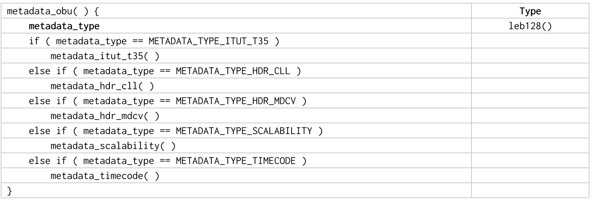
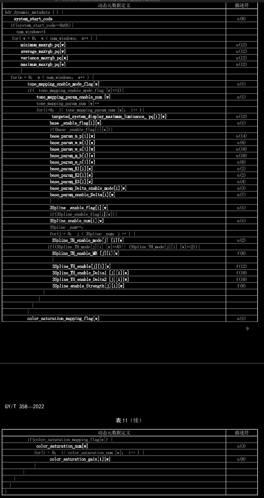

# Metadata OBU
OBU(Open Bitstream Unit)
metadata_type 元数据OBU类型

## 结构


## 字段
metadata_type: 元数据OBU类型
| 类型 | 描述 |
| ---- | ---- |
|   0   |   保留   |
|   1   |   METADATA_TYPE_HDR_CLL   |
|   2   |   METADATA_TYPE_HDR_MDCV   |
|   3   |   METADATA_TYPE_SCALABILITY   |
|   4   |   METADATA_TYPE_ITUT_T35   |
|   5   |   METADATA_TYPE_TIMECODE   |
|   6-31   |   Unregistered user private   |
|   >=32   |   Reserved for AOM use   |

其中,
- METADATA_TYPE_HDR_CLL: Metadata high dynamic range __content light level__ syntax
- METADATA_TYPE_HDR_MDCV: Metadata high dynamic range __mastering display color volume__ syntax

目前来看, 6-31可用来存储HDR Vivid动态元数据

# av1+HDR编码方案
## HDR10编码指令
```bash
# APP
## 编码
./SvtAv1EncApp -i /home/chaos/Videos/lifeofpi_1920x1080_f25_yuv420p10le_frm1326.yuv -w 1920 -h 1080 --fps 25 --rc 0 --preset 7 --lookahead 35 --keyint 125 --enable-stat-report 0 --frames 100  -b 10bit_plushdr.ivf --input-depth 10 --color-primaries bt2020 --transfer-characteristics smpte2084 --matrix-coefficients bt2020-ncl --content-light "1000,500" --mastering-display "G(13250,34500)B(7500,3000)R(34000,16000)WP(15635,16450)L(10000000,1)"
## 解码
dav1d -i ./10bit_plushdr.ivf -o 10bit_plushdr_1920x1080.yuv

# FFMPEG
ffmpeg -i /media/microsoft1/seq/HDR/芒果实验室_HDR10_1080P25FPS.mp4 -c:v libsvtav1 -svtav1-params "input-depth=10:color-primaries=bt2020:transfer-characteristics=smpte2084:matrix-coefficients=bt2020-ncl:content-light=1000,500:mastering-display=G(13250,34500)B(7500,3000)R(34000,16000)WP(15635,16450)L(10000000,1)" ffmpeg_10bit_av1_params.mp4
```

## HDR Vivid方案

### 码流结构
| metadata_obu | Type |
| ---- | ---- |
|   __metadata_type__   |   __leb128()__   |
|   if( metadata_type == METADATA_TYPE_ITUT_T35 )   |      |
|       metadata_itut_t35()   |      |
|   if( metadata_type == METADATA_TYPE_HDR_CLL )   |      |
|       metadata_hdr_cll()   |      |
|   if( metadata_type == METADATA_TYPE_HDR_MDCV)   |      |
|       metadata_hdr_mdcv()   |      |
|   if( metadata_type == METADATA_TYPE_SCALABILITY)   |      |
|       metadata_scalability()   |      |
|   if( metadata_type == METADATA_TYPE_TIMECODE)   |      |
|       metadata_timecode()   |      |
|   if( metadata_type == _METADATA_TYPE_HDR_VIVID_)   |      |
|       _metadata_hdr_vivid()_   |      |

其中
- _METADATA_TYPE_HDR_VIVID_ 为6-31的值，可自定义, 暂定为10;
- _metadata_hdr_vivid()_ 为HDR Vivid元数据结构, 参考联盟定义


#### metadata_hdr_vivid()(GB)


| 动态元数据定义 | 描述符 |
|----------------|--------|
| hdr_dynamic_metadata() { |  |
|  __system_start_code__ | u(8) |
| if(system_start_code==0x01) { |  |
| num_windows=1 |  |
| for(w = 0; w < num_windows; w++) { |  |                                                                                           
| __minimum_maxrgb_pq[w]__ | u(12) |
| __average_maxrgb_pq[w]__ | u(12) |
| __variance_maxrgb_pq[w]__ | u(12) |
| __maximum_maxrgb_pq[w]__ | u(12) |
| } |  |
| for(w = 0; w < num_windows; w++) { |  |
| tone_mapping_enable_mode_flag[w] | u(1) |
| if(tone_mapping_enable_mode_flag[w]==1) { |  |
| tone_mapping_param_enable_num[w] | u(1) |
| tone_mapping_param_num[w]++ |  |
| for(i=0; i< tone_mapping_param_num[w]; i++) { |  |
| targeted_system_display_maximum_luminance_pq[i][w] | u(12) |
| base_enable_flag[i][w] | u(1) |
| if(base_enable_flag[i][w]) { |  |
| base_param_m_p[i][w] | u(14) |
| base_param_m_n[i][w] | u(6) |
| base_param_m_a[i][w] | u(10) |
| base_param_m_b[i][w] | u(10) |
| base_param_m_n[i][w] | u(6) |
| base_param_K1[i][w] | u(2) |
| base_param_K2[i][w] | u(2) |
| base_param_K3[i][w] | u(4) |
| base_param_Delta_enable_mode[i][w] | u(3) |
| base_param_enable_Delta[i][w] | u(7) |
| } |  |
| 3Spline_enable_flag[i][w] | u(1) |
| if(3Spline_enable_flag[i][w]) { |  |
| 3Spline_enable_num[i][w] | u(1) |
| 3Spline_num++; |  |
| for(j = 0; j < 3Spline_num; j++) { |  |
| 3Spline_TH_enable_mode[j][i][w] | u(2) |
| if((3Spline_TH_mode[j][i][w]==0) || (3Spline_TH_mode[j][i][w]==2)) { |  |
| 3Spline_TH_enable_MB[j][i][w] | f(8) |
| } |  |
| 3Spline_TH_enable[j][i][w] | f(12) |
| 3Spline_TH_enable_Delta1[j][i][w] | f(10) |
| 3Spline_TI_enable_Delta2[j][i][w] | f(10) |
| 3Spline_enable_Strength[j][i][w] | f(8) |
| } |  |
| } |  |
| } |  |
| color_saturation_mapping_flag[w] | u(1) |

