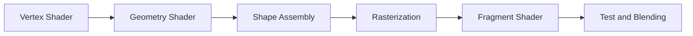

# PipeLine

**VAO** Vertex Array Object 顶点数组对象

**VBO** Vertex Buffer Object 顶点缓冲区对象

**EBO**/**IBO** Element Buffer Object 元素缓冲对象 Index Buffer Object 索引缓冲对象



其中VertexShader GeometryShader和FragmentShader是可注入自定义shader的部分。Fragment是OpenGL渲染一个像素所需的所有数据

Geometry Shader是通过顶点数据形成装成图元(Primitive)， 图元是指定顶点数据渲染类型所作出的提示：GL_POINTS GL_LINES GL_TRIANGLES(点线面)

OpenGL 是将3D坐标转化为2D像素。3D坐标->2D像素的处理过程就是OpenGL的图像渲染管线(Graphics Pipeline)

Graphics Pipeline也可分为两个部分， 一是3D坐标转换成2D坐标， 二是2D坐标转换为实际有色像素。

## 着色器简介

- Vertex Shader 将3D坐标转化为另一3D坐标
- Geometry Shader （可选）依靠一组顶点形成图元
- Shape Assembly 将前一步输出的顶点装配成图元的形状
- Rasterization 将图元映射为屏幕上的像素
- Before FS 裁剪掉超出视图的像素（Clipping）
- Fragment Shader 计算像素的最终颜色。OpenGL所有高级效果产生的地方，通常包含阴影、光照、光的颜色等。
- alphaTest and Blending 检测Fragment的depth和stencil

## Graphic Pipeline Flow

## 输入顶点规范

    标准化设备坐标Normalized Device Coordinates(NDC)：(x,y,z)三个轴都在-1.0到1.0之间的坐标。只有此范围内的坐标才会显示在屏幕上。

先定义一个图形的坐标
```cpp 
//位于z=0上的二维三角形▶
float vertices[] = {-1.0f, 1.0f,  0.0f,
                    -1.0f, -1.0f, 0.0f,
                    1.0f,  0.0f,  0.0f   }
```
a. memory to GPU-memory

.b. custom shader(vertex shader, fragment shader)

.c. compile shader

.d. link shader obj to shader program, and activate

e. link vertex data(in VBO) to vertex attributes in vertex shader(How to explain the vertex data)

f. VAO


## EBO && IBO
EBO(Element Buffer Object)和IBO(Index Buffer Object)是OpenGL中用于索引顶点数据的对象。EBO用于存储顶点索引，IBO用于存储顶点属性。


# 着色器Shader
