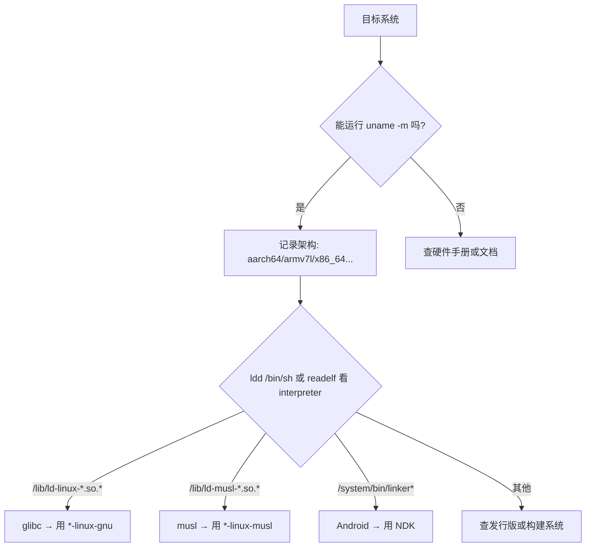

# 交叉编译流程

# 1 获取target信息

```shell
[target]:   uname -m    # 获取目标架构

[target]:   ldd --version   # 查看C标准库类型** 

[target]:   uname -r  # 查看内核版本(辅助)

[target]:   cat /etc/os-release  # 查看操作系统版本
```



# 2 获取交叉编译工具链
https://developer.arm.com/downloads/-/gnu-a

解压至/opt

添加/opt/xxx/bin到PATH

# 3 配置交叉编译环境
GCC: 配置工具
CMake, meson等: 使用配置文件(项目一般会提供样板文件,根据实际的交叉编译工具链修改即可)

